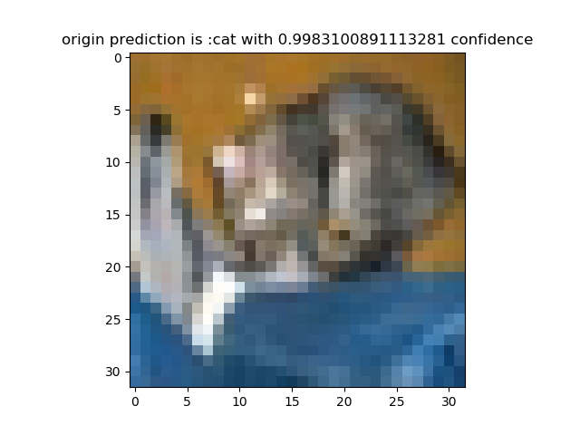
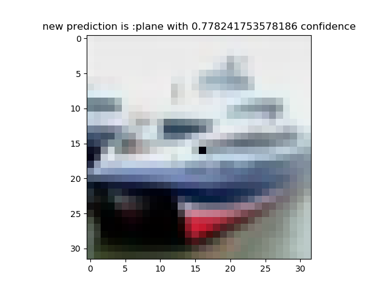

This is a simple implementation of **One Pixel Attack for Fooling Deep Neural Networks**

## basic idea

Use differential evolution to find the best pixel and the best RGB value to perturb.

Specifically, the differential evolution select the next generation by
$$
x_i(g+1) = x_{r1}(g)+F(x_{r2}(g)-x_{r3}(g))
$$
Note that the second term in the original paper is $F(x_{r2}(g)+x_{r3}(g))$ , However, I chose to change plus into minus because the original form of differential evolution is minus.

$r1,r2,r3$ are three random numbers in the range of the number of candidates in one generation.

## result

Setting iterate time to 20 and picking 100 pictures to run success_rate.py, I found that the success rate of non-target attack is **70%**. Maybe the result will improve as you change the iterate time in attack.py(generate())

## example

